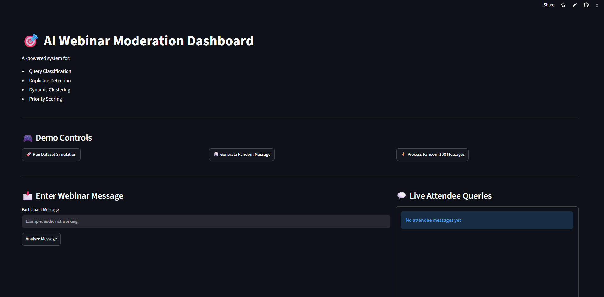
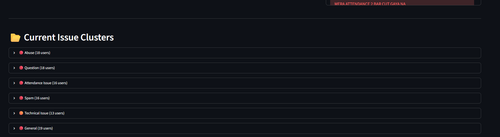
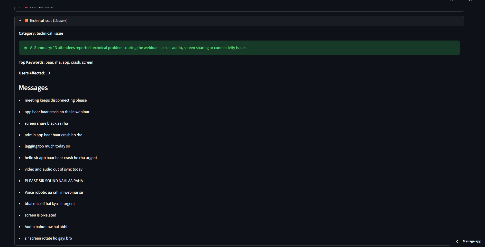

# 🎯 AI Webinar Moderation System

An AI-powered real-time webinar intelligence and moderation platform that automatically detects attendee issues, clusters duplicate complaints, analyzes sentiment, generates summaries, and prioritizes critical concerns for webinar hosts.

---

# 🌐 Live Demo

### Streamlit Dashboard

https://ai-webinar-moderation-system.streamlit.app/

### GitHub Repository

https://github.com/heyyveer/AI-Webinar-Moderation-System

--

# 📸 Dashboard Preview

## Main Dashboard



## AI Issue Clustering



## Sentiment Analysis



---

# 🚀 Overview

Large webinars often generate hundreds of attendee messages every minute.

Important issues such as:

* Audio problems
* Attendance complaints
* Screen-sharing failures
* Technical difficulties
* Spam messages
* Participant questions

can easily get buried inside the chat stream.

This project leverages Machine Learning, NLP, Semantic Similarity, Sentiment Analysis, and Real-Time Processing to automatically identify and prioritize attendee concerns.

---

# ❗ Problem Statement

In large-scale virtual events:

* Moderators cannot manually monitor every message.
* Duplicate complaints flood the chat.
* Critical issues remain unnoticed.
* Hosts receive delayed feedback.
* Participant experience suffers.

Example:

```text
audio not working
can't hear speaker
speaker not audible
voice issue
```

All of these messages represent the same underlying issue.

Traditional webinar platforms treat them as separate messages.

---

# ✅ Solution

The AI Webinar Moderation System automatically:

* Classifies attendee messages
* Detects duplicate complaints
* Groups similar complaints together
* Calculates issue priority
* Performs sentiment analysis
* Generates AI summaries
* Highlights critical issues in real time

Example:

```text
⚠ Audio Issue

Affected Users: 132

Sentiment: Negative

Priority: HIGH
```

---

# 🧠 Key Features

## Query Classification

Automatically classifies attendee messages into:

* Technical Issues
* Attendance Issues
* Questions
* Spam
* Abuse
* General Messages

---

## Semantic Similarity Detection

Uses Sentence Transformers and Cosine Similarity to identify messages with similar meaning.

Example:

```text
audio not working
voice issue
cannot hear speaker
speaker not audible
```

---

## Dynamic Issue Clustering

Groups similar attendee complaints into a single cluster.

Example:

```text
Audio Issue

Affected Users: 85
```

---

## Priority Scoring Engine

Calculates issue severity using:

* Issue category
* Number of affected attendees

Priority Levels:

```text
LOW
MEDIUM
HIGH
CRITICAL
```

---

## Sentiment Analysis

Analyzes attendee emotions in real time.

Example:

```text
This webinar is useless
→ Negative

Great explanation sir
→ Positive

What is tokenization?
→ Neutral
```

---

## AI-Powered Issue Summarization

Generates concise summaries of attendee concerns.

Example:

```text
18 attendees reported concerns related to
audio, speaker, and voice issues.
```

---

## FastAPI Backend

Provides APIs for:

* Message Processing
* Issue Classification
* Sentiment Analysis
* Real-Time Integration

---

## WebSocket Support

Supports real-time attendee message processing.

Example Flow:

```text
Attendee Message
        ↓
WebSocket
        ↓
AI Processing
        ↓
Dashboard Update
```

---

## Interactive Streamlit Dashboard

Dashboard Features:

* Live attendee feed
* Query classification
* Sentiment monitoring
* Cluster visualization
* AI summaries
* Top issue detection
* System statistics

---

# 📊 AI Pipeline

```text
Incoming Message
        ↓
Text Cleaning
        ↓
TF-IDF Vectorization
        ↓
Query Classification
        ↓
Sentiment Analysis
        ↓
Semantic Similarity Detection
        ↓
Issue Clustering
        ↓
Priority Scoring
        ↓
AI Summarization
        ↓
Dashboard Update
```

---

# 🏗 System Architecture

```text
Attendee Message
        ↓
FastAPI Backend
        ↓
Classification Model
        ↓
Sentiment Engine
        ↓
Semantic Similarity Engine
        ↓
Issue Clustering
        ↓
Priority Engine
        ↓
AI Summarization
        ↓
Streamlit Dashboard
```

---

# 🛠 Technology Stack

## Machine Learning & NLP

* Python
* Scikit-learn
* TF-IDF Vectorization
* Logistic Regression
* Sentence Transformers
* Cosine Similarity

## Backend

* FastAPI
* WebSockets
* Uvicorn

## Dashboard

* Streamlit

## Data Processing

* Pandas
* NumPy
* Joblib

---

# 📁 Project Structure

```text
AI-Webinar-Moderation-System/

├── backend/
│   ├── api/
│   ├── websocket/
│   └── services/
│
├── dataset/
│
├── model/
│   └── query_classifier/
│
├── process_message.py
├── streamlit_app.py
├── requirements.txt
└── README.md
```

---

# 📈 Current Progress

### Completed

✅ Query Classification

✅ Semantic Duplicate Detection

✅ Dynamic Clustering

✅ Priority Scoring Engine

✅ Sentiment Analysis

✅ AI Summarization

✅ FastAPI Backend

✅ WebSocket Integration

✅ Streamlit Dashboard

✅ Live Deployment

---

# 🎯 Use Cases

* Online Classes
* University Webinars
* Corporate Meetings
* Virtual Conferences
* Enterprise Events
* Technical Support Sessions

---

# 🔮 Future Enhancements

* Google Meet Integration
* Zoom Integration
* Microsoft Teams Integration
* Multi-language Support
* LLM-Based Issue Reports
* Automated Moderator Assistant
* Advanced Analytics Dashboard

---

# 👨‍💻 Author

**Veer Tiwari**

Machine Learning Engineer | AI Enthusiast

GitHub: https://github.com/heyyveer

---

# ⭐ Support

If you found this project useful, consider giving the repository a star.

Contributions, suggestions, and feedback are always welcome.
